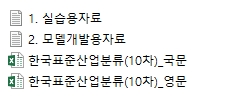

# Industrial-AI

## Problem

### 주어진 데이터

1. 실습용 자료 : 1000000개의 데이터 
산업대분류(digit_1), 산업중분류(digit_2), 산업소분류(digit_3), 사업 대상(text_obj), 사업 방법(text_mthd), 사업 취급품목(text_deal)

2. 모델 개발용 자료 : 100000개의 데이터 
일련번호(AI_id), 사업 대상(text_obj), 사업 방법(text_mthd), 사업 취급품목(text_deal)

3. 한국표준산업분류 : 대분류 21개, 중분류 77개, 소분류 232개, 세분류 495개, 세세분류 1196개

- 여기서 digit_1은 대분류, digit_2는 중분류, digit_3은 소분류를 의미한다.
- 세분류, 세세분류 정보가 도움이 되는지 모르겠음

4. 한국표준산업분류_영문 : 영어로 번역한 분류명

### 문제

한 사업에 대해서 정보(사업 대상, 사업 방법, 사업 취급 품목)이 주어 졌을 때, 해당 사업의 분류(대분류, 중분류, 소분류)를 추론하는 것

### 답안 제출

2번 모델 개발용 자료를 digit_1, digit_2, digit_3을 추론하고, 답안 작성용 파일을 작성하여 제출

## ToDo List

- [ ] 전처리 방법 생각해보기
- [ ] 없는 데이터에 대하여 어떻게 할지
- [ ] input을 어떻게 할지
- [ ] model을 어떻게 할지
- [ ] output을 어떻게 할지
- [ ] nlp 공부

## 참고할만한 사이트
<https://wikidocs.net/book/2155>
